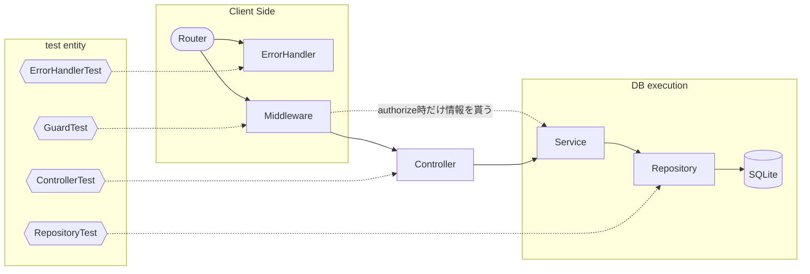
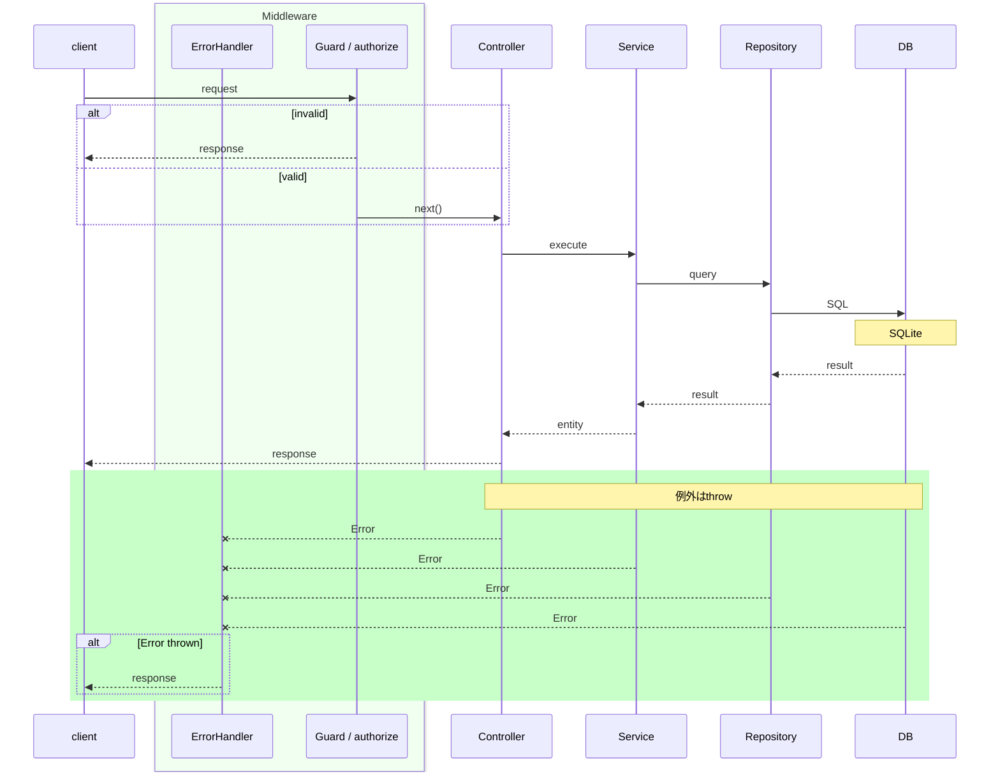

### [要件定義書](./docs/features.md)
### [BEセキュリティ](./docs/BE_Security.md)
### [全体図](./docs/PortforioFlow.mermaid)

<details>
  <summary>その他レポートなど</summary>

  * <a href="./docs/test/analyzeTestPerformance.md">テスト時間遷移における実行時間スパイクに関して</a>
  * <a href="./docs/test/testResults.md">testResults</a>
</details>

---

## ポートフォリオの肝

### BE Test
```sh
Current Result:
Test Files  9 passed (9)
     Tests  48 passed (48)
  Duration  3.16s (transform 756ms, setup 0ms, import 3.11s, tests 954ms, environment 1ms)
```


### BE Request Sequence

