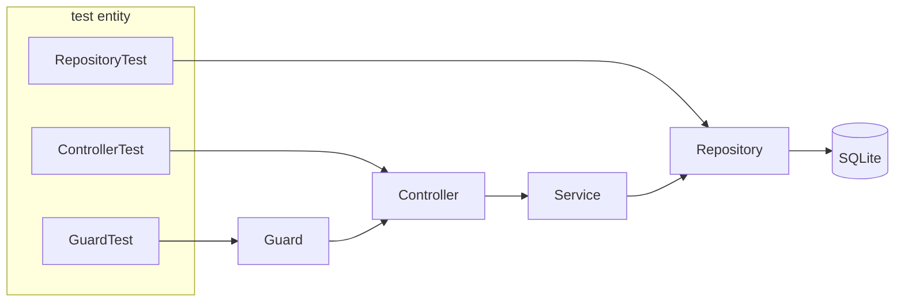
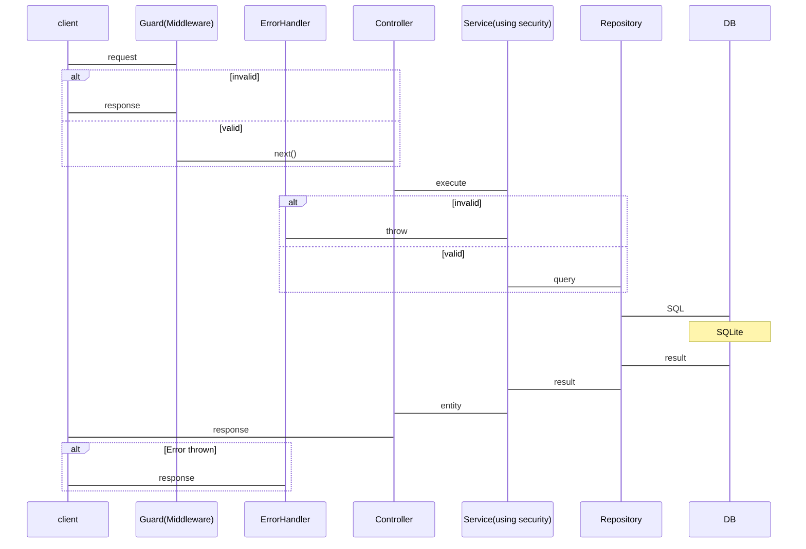

### [要件定義書](./docs/features.md)
### [BEセキュリティ](./docs/BE_Security.md)
### [全体図](./docs/PortforioFlow.mermaid)

---

## このポートフォリオの肝

### BE Test
```sh
current test result:
Test Files  6 passed (6)
     Tests  34 passed (34)
  Duration  2.80s (transform 1.08s, setup 0ms, import 3.13s, tests 721ms, environment 1ms)
```


### BE Request Flow

