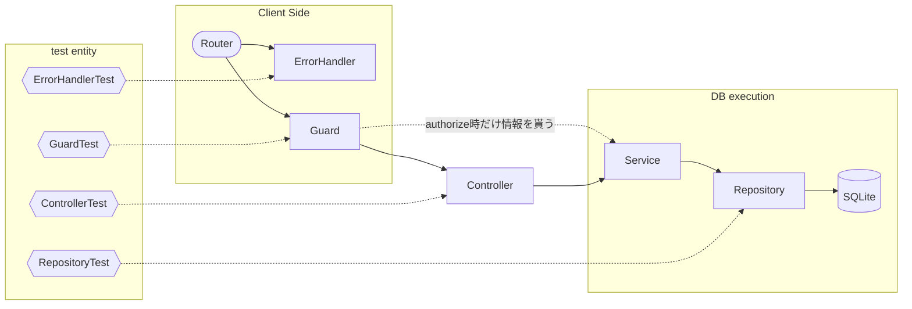
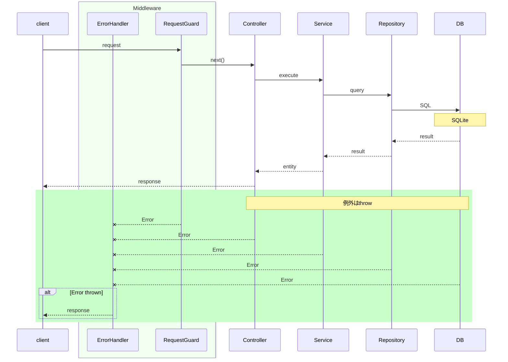

### [要件定義書](./docs/features.md)
### [BEセキュリティ](./docs/BE_Security.md)
### [全体図](./docs/PortforioFlow.mermaid)

<details>
  <summary>その他レポートなど</summary>

  * <a href="./docs/errors/createProject_unauthorizedError.md">fetchにおけるcredential設定ミスによるエラーと解決までの道のり</a>
  * <a href="./docs/test/analyzeTestPerformance.md">テスト時間遷移における実行時間スパイクに関して</a>
  * <a href="./docs/test/testResults.md">testResults</a>
</details>

## 設計上の意思決定 (Architecture Decision Log)

このポートフォリオでは、保守性と開発効率のバランスを考慮した設計判断を目指しています。
具体的な判断基準については、以下の Issue 記録を参照してください。

- **[非同期ロジックの管理方針について](/../../issues/2)**
  - なぜ Custom Hook 化をあえて見送ったのか、デバッグ効率と認知負荷の観点から論理的な境界線を定義しています。

## メモ
* features = 広義のドメインロジック

---

## ポートフォリオの肝

### BE Test
```sh
Test Files  9 passed (9)
     Tests  48 passed (48)
  Start at  12:29:50
  Duration  3.85s (transform 1.28s, setup 0ms, import 4.27s, tests 987ms, environment 1ms)
```


### BE Request Sequence

