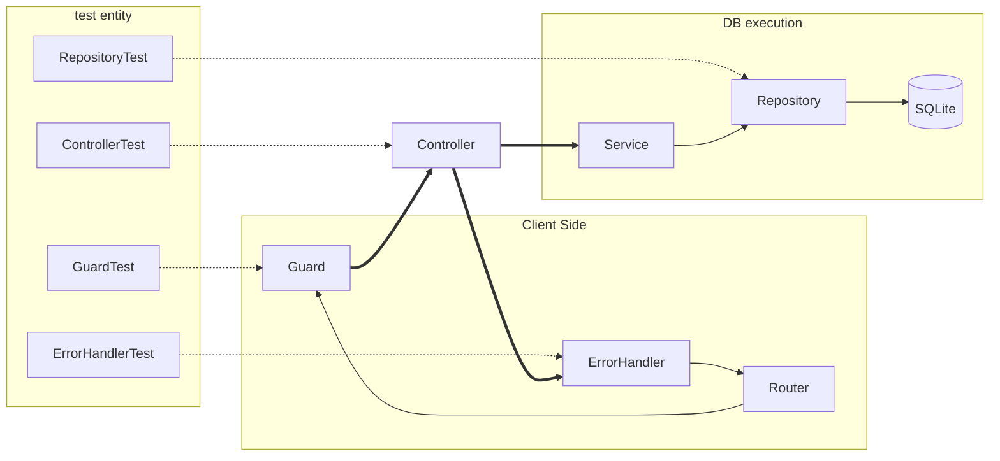
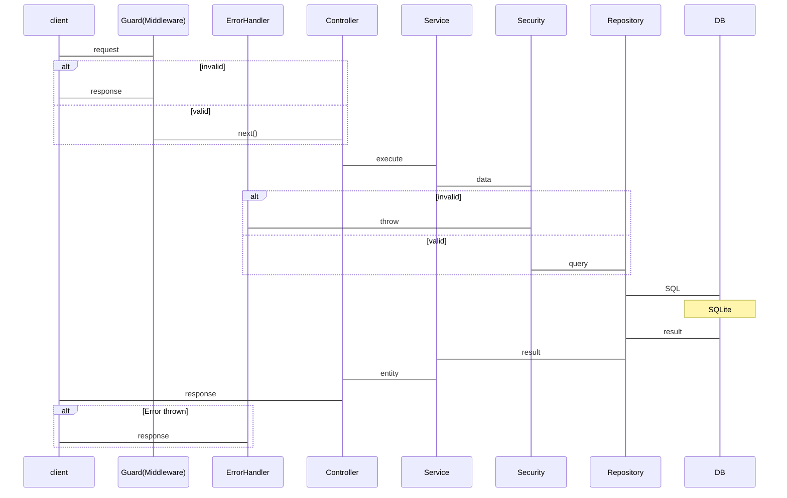

### [要件定義書](./docs/features.md)
### [BEセキュリティ](./docs/BE_Security.md)
### [全体図](./docs/PortforioFlow.mermaid)

---

## ポートフォリオの肝

### BE Test
```sh
Current Result:
Test Files  8 passed (8)
     Tests  46 passed (46)
  Start at  17:20:51
  Duration  6.04s (transform 7.23s, setup 0ms, import 9.35s, tests 912ms, environment 1ms)
```


### BE Request Flow

