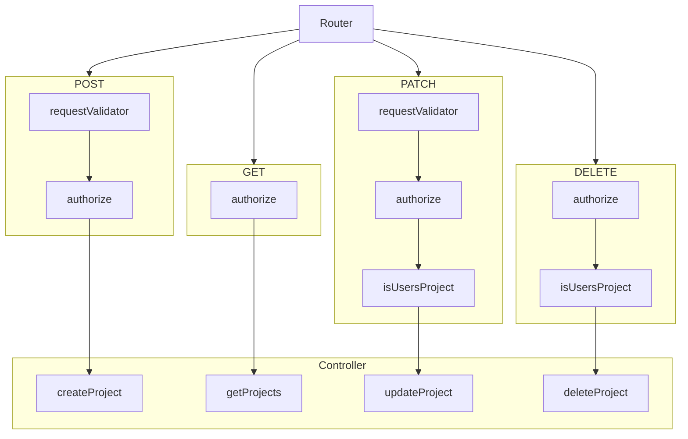
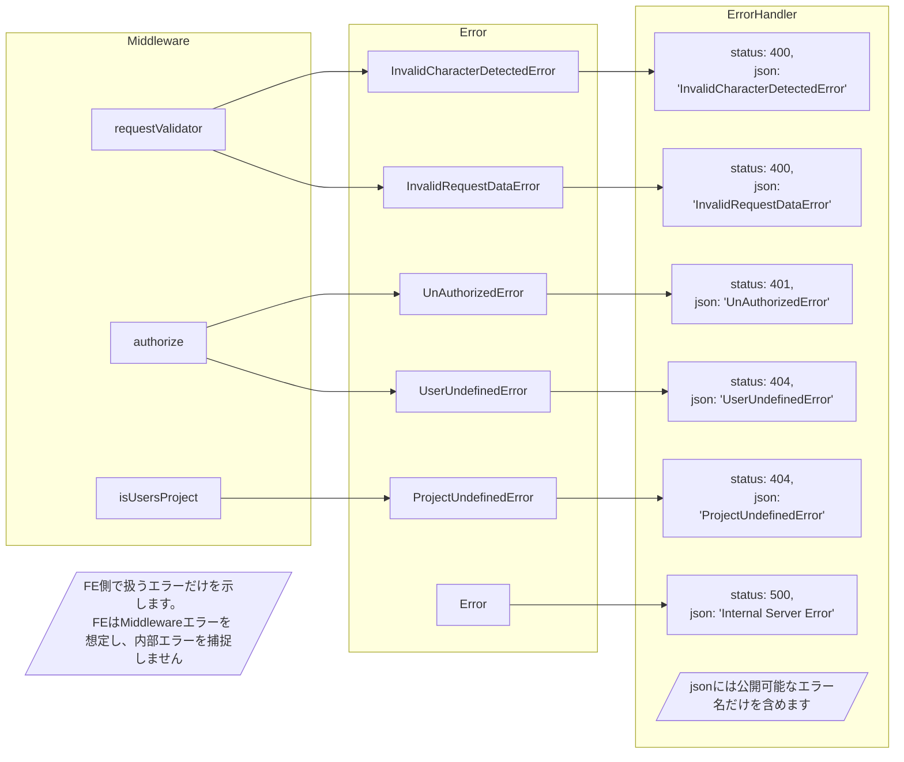

## Routing

```mermaid
graph TB
  Router
  Router --> POST
  Router --> GET
  Router --> PATCH
  Router --> DELETE

  subgraph Controller
    createProject
    getProjects
    updateProject
    deleteProject
  end
  subgraph POST
    direction TB
    reqValidator1[requestValidator]
    --> auth1[authorize]
    ---> createProject
  end
  subgraph GET
    direction TB
    auth2[authorize]
    ---> getProjects
  end
  subgraph PATCH
    direction TB
    reqValidator2[requestValidator]
    --> auth3[authorize]
    --> isUsersProj1[isUsersProject]
    --> updateProject
  end
  subgraph DELETE
    direction TB
    auth4[authorize]
    --> isUsersProj2[isUsersProject]
    --> deleteProject
  end


```

## ErrorMap

```mermaid
graph LR
  noteTopA[/FE側で扱うエラーだけを示します。
  FEはMiddlewareエラーを想定し、内部エラーを捕捉しません/]

  subgraph Middleware
    requestValidator
    requestValidator
    authorize
    authorize
    isUsersProject
  end

  subgraph ErrorHandler
    400A[status: 400,
    json: 'InvalidCharacterDetectedError']
    400B[status: 400,
    json: 'InvalidRequestDataError']
    401A[status: 401,
    json: 'UnAuthorizedError']
    404A[status: 404,
    json: 'UserUndefinedError']
    404B[status: 404,
    json: 'ProjectUndefinedError']
    other[status: 500,
    json: 'Internal Server Error']
    noteErrorHandlerA[/jsonには公開可能なエラー名だけを含めます/]
  end

  subgraph Error
    InvalidCharacterDetectedError --> 400A
    InvalidRequestDataError --> 400B
    UnAuthorizedError --> 401A
    UserUndefinedError --> 404A
    ProjectUndefinedError --> 404B
    otherError[Error] --> other
  end

  requestValidator --> InvalidCharacterDetectedError
  requestValidator --> InvalidRequestDataError
  authorize --> UnAuthorizedError
  authorize --> UserUndefinedError
  isUsersProject --> ProjectUndefinedError
```