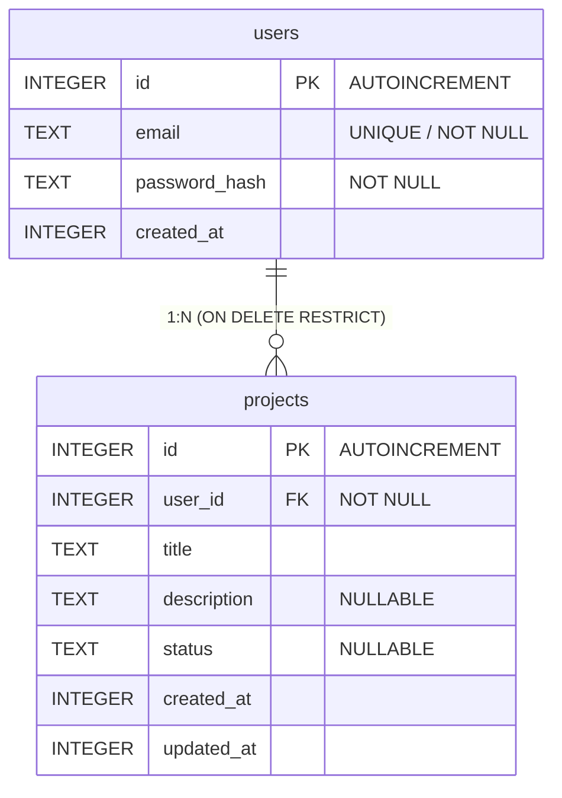

```mermaid
erDiagram
    users ||--o{ projects : "1:N (ON DELETE RESTRICT)"

    users {
        INTEGER id PK "AUTOINCREMENT"
        TEXT email "UNIQUE / NOT NULL"
        TEXT password_hash "NOT NULL"
        INTEGER created_at
    }

    projects {
        INTEGER id PK "AUTOINCREMENT"
        INTEGER user_id FK "NOT NULL"
        TEXT title
        TEXT description "NULLABLE"
        TEXT status "NULLABLE"
        INTEGER created_at
        INTEGER updated_at
    }
```