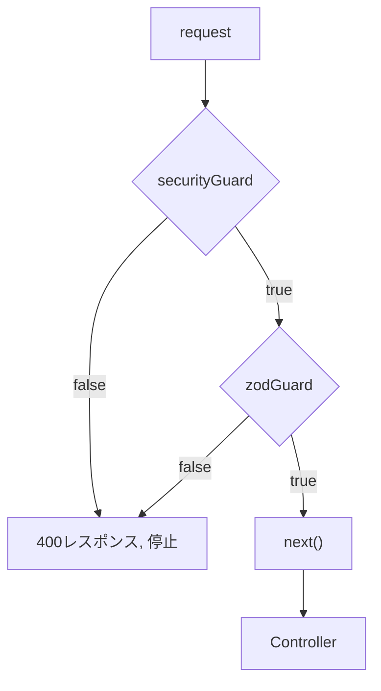

## 多層防御設計 (Defense in Depth)

本プロジェクトでは、悪意あるデータやリクエストを防ぐため、複数の独立したガード層 を設けています。

### レイヤー構造
| 層 |	役割 |	実装済み手法 |	備考 |
| --- | --- | --- | --- |
| app.use(json()) | サイズ制限 | limit: "1kb" | |
| Security Guard | 悪意ある文字列・制御文字・不正リクエストの初期検知 制御文字チェック (\u0000-\u001F, \u007F) | 制御文字を空白に置き換えた結果を、元のデータと比較して判定する | booleanを返す <br /> 即レスポンスする |
| Zod Guard | データ型・構造の検証 <br /> 型チェック (string, number, optional など) |  Schema.pick().strict() など | booleanを返す <br /> 即レスポンスする |

### 集約ガードの設計
```ts
// requestValidator の構造

export const requestValidator = (
  req: Request,
  res: Response,
  next: NextFunction,
  requestName: RequestName
) => {
  if (!securityGuard(req, res)) return;
  if (!zodGuard(req, res, requestName)) return;

  next();
}
```

### 特徴

* 各ガードは boolean を返却し、異常時は次の層に進まない

* requestValidationで一般化しており、requestNameを選択して使用する

* 統合テストの手間が少なく、個別ガードの単体テスト・変更も可能

###  防御対象・手法
| 攻撃種別 | 防御層 | 実装 | ポイント |
| --- | --- | --- | --- |
| リクエストサイズ超過 | ExpressApp |	```app.use(json({ limit: "1kb" })) ``` | 巨大リクエストによる DoS を防ぐ |
| 制御文字・不可視文字 | Security Guard	| removeControlChars() <br /> 出力サニタイズ | 関数で除去・検知 ログ破壊・文字化け防止 |
| 不正 HTML/JS (XSS) | Security Guard | \<script\> などを拒否 | |
| リクエスト必須項目欠如 | Zod Guard | body必須項目チェック	<br /> 必須フィールドの欠落を弾く | |
| データ型・構造不正 | Zod Guard | Zod スキーマバリデーション	 | 型・構造の整合性を保証 |
| Repositoryへのbypass | Db Security | repository.guardなどを置き、repository呼び出し直前の使用を義務化 | 都度認証があるかを検閲するため、保護範囲が明確 |

### 多層防御のフロー


### 利点

* 層ごとに責務を明確化

* 不正入力や攻撃文字列は早期に弾き、正常データのみ型チェックに通す


### テスト方針

* Security Guard は boolean を返すことで、異常系・正常系の判定を明確化

* Zod Guard はスキーマに沿った型チェックを単体で検証

* 集約ラッパー は全層を通過した場合にのみ next() が呼ばれることを確認

### DB防御
repositoryへの不正バイパスを防ぐために、repository使用とセットでDbGuardを書くことを義務付けています
```ts
dbSecurityGuard(data);
await UsersRepository.saveUser(data);
```

### 今後の拡張余地
* SQLインジェクション防止
* 参照権限チェック
* データ暗号化
* レート制御
* 秒間リクエスト制限やIP単位制御
* ログサニタイズ

制御文字を含むログ出力時の破壊防止