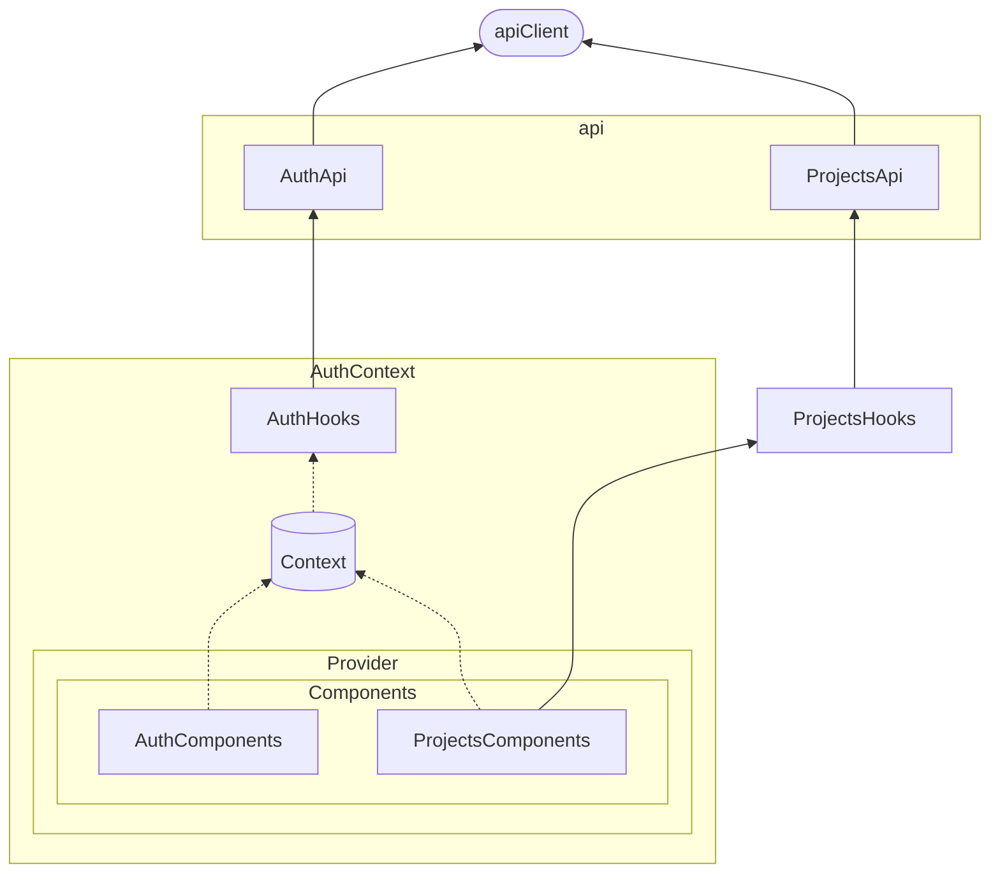

## ・features flow
※ProjectsもContext化が可能ですが優先度が低いため保留中です

```mermaid
graph BT
  ApiClient([apiClient])

  AuthApi
  ProjectsApi

  subgraph AuthContext
    direction BT

    Context[(Context)]

    AuthHooks

    subgraph Provider
      direction BT

      subgraph Components
        AuthComponents
        ProjectsComponents
      end
    end
  end

  subgraph api
    AuthApi
    ProjectsApi
  end


  AuthHooks
  ---> AuthApi

  ProjectsComponents
  ---> ProjectsHooks
  ---> ProjectsApi

  AuthApi & ProjectsApi --> ApiClient


  Context -.-> AuthHooks
  AuthComponents & ProjectsComponents -.-> Context

```
