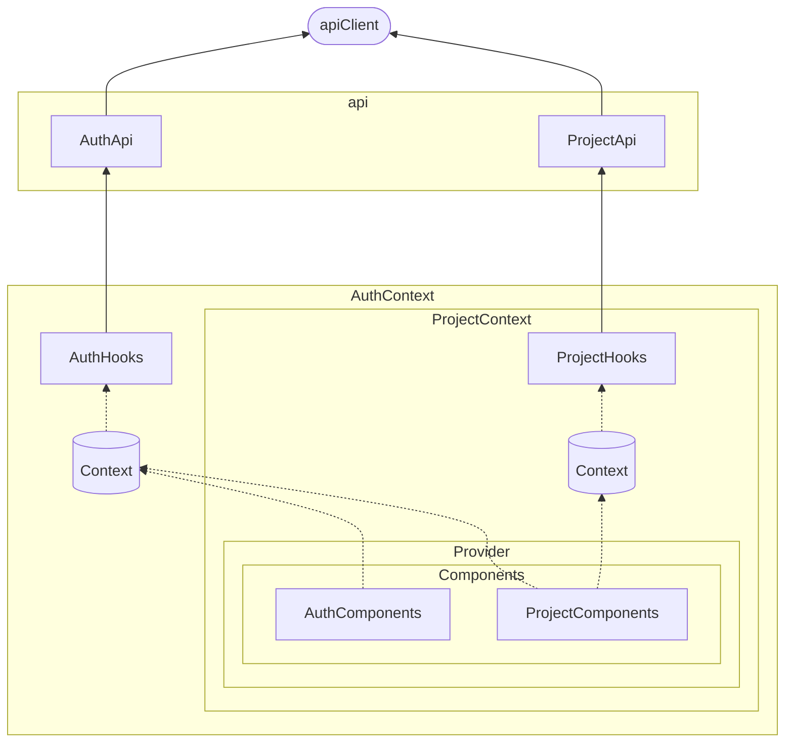

## ・features flow

```mermaid
graph BT
  ApiClient([apiClient])

  AuthApi
  ProjectApi

  subgraph AuthContext
    direction BT

    AuthCtx[(Context)]
    AuthHooks

    subgraph ProjectContext
      direction BT

      ProjectCtx[(Context)]
      ProjectHooks

      subgraph Provider
        direction BT

        subgraph Components
          AuthComponents
          ProjectComponents
        end
      end
    end
  end

  subgraph api
    AuthApi
    ProjectApi
  end


  AuthHooks
  ---> AuthApi

  ProjectHooks
  ---> ProjectApi

  AuthApi & ProjectApi --> ApiClient


  AuthCtx -.-> AuthHooks
  ProjectCtx -.-> ProjectHooks
  AuthComponents & ProjectComponents -.-> AuthCtx
  ProjectComponents -.-> ProjectCtx

```
