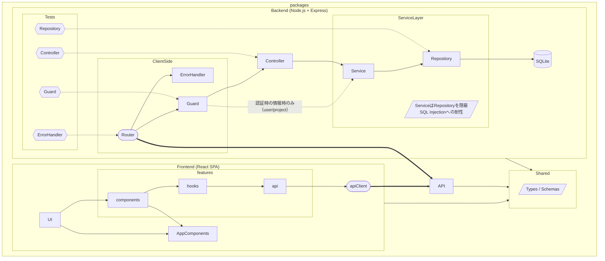

```mermaid
flowchart LR
  subgraph packages
    direction LR

    subgraph BE["Backend (Node.js + Express)"]
      subgraph Test["Tests"]
        ErrorHandlerTest{{ErrorHandler}}
        ControllerTest{{Controller}}
        GuardTest{{Guard}}
        RepositoryTest{{Repository}}
      end

      subgraph ClientSide
        Router([Router])
        ErrorHandler
        Middleware["Guard"]
      end
      Controller[Controller]
      subgraph ServiceLayer
        note_ServiceLayer[/ServiceはRepositoryを隠蔽\nSQL Injectionへの耐性/]
        Service
        Repository[Repository]
      end
      DB[(SQLite)]

      %% Backend Flow
      Router --> ErrorHandler
      Router --> Middleware
      Middleware --> Controller
      Middleware -.->|認証時の情報時のみ（user/project）| Service
      Controller --> Service
      Service --> Repository
      Repository --> DB

      %% Tests
      GuardTest -.-> Middleware
      ControllerTest -.-> Controller
      RepositoryTest -.-> Repository
      ErrorHandlerTest -.-> Router
    end

    subgraph Shared["Shared"]
      SharedTypes[/Types / Schemas/]
    end

    subgraph FE["Frontend (React SPA)"]
      direction LR

      subgraph Features[features]
        components
        --> hooks
        --> api
      end
      apiClient([apiClient])

      %% FE Flow
      UI
      --> components

      UI & components --> AppComponents

      api --> apiClient
    end

    %% Frontend <-> Backend
    apiClient ==> API
    Router ==> API

    %% -> Shared
    FE --> Shared
    BE --> Shared
    API --> Shared
  end
```
