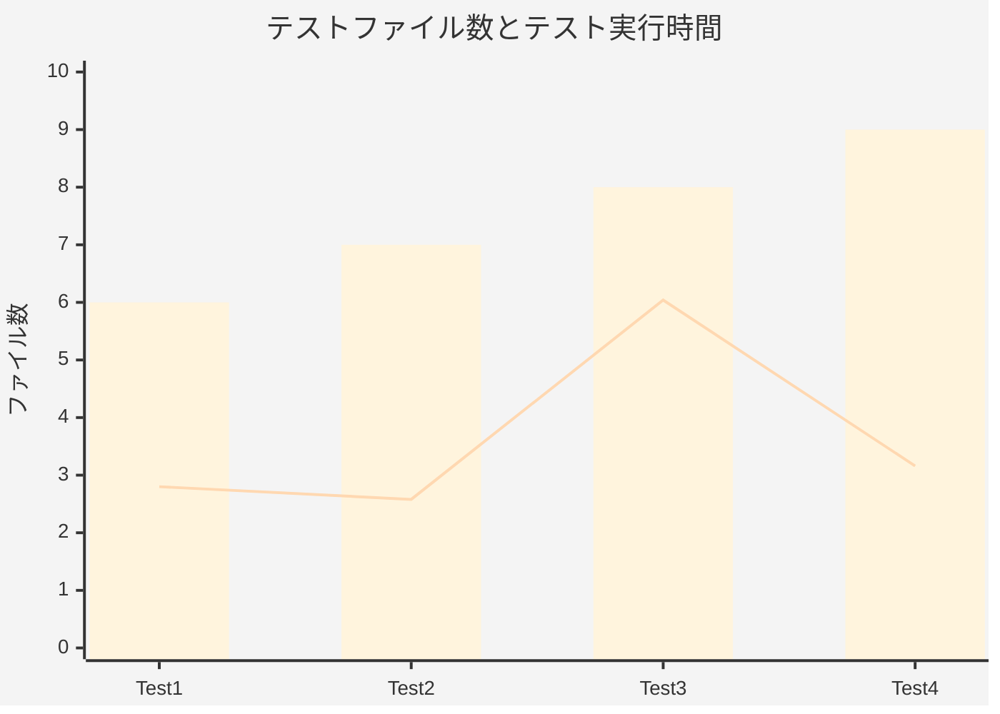
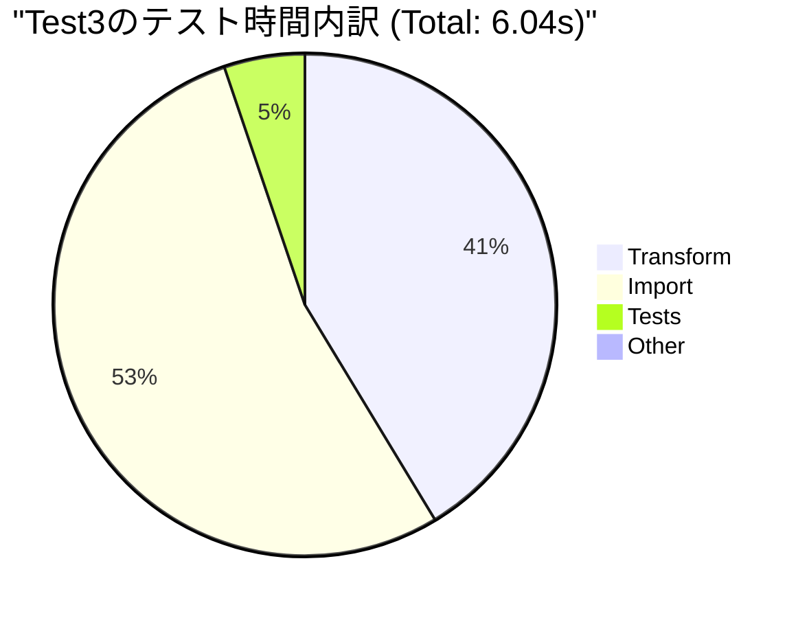
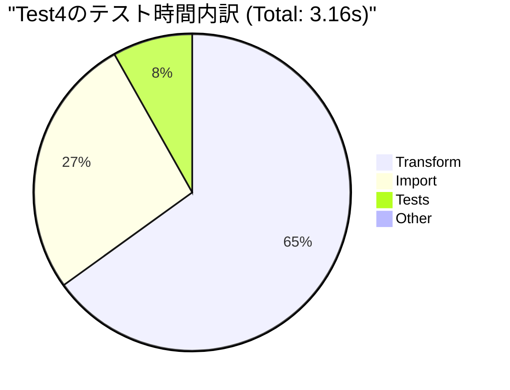

* Test1: Controller/Serviceなどの設計後テスト
* Test2: 多層防御フロー見直し後のテスト
* Test3: isLoggedInを /session にfetchする形に変更した際のテスト
* Test4: ExpressのMiddleware動作を学習し、ファクトリ化を改修


---




---

## Test3でのテスト時間スパイクについて
### Test3の直前に行われた改修
* ```fetch: /isLoggedIn``` を ```fetch: /session``` に以降
* Middleware/Controller周りに変更が集中

### Test4の直前に改修された内容
* middlewareのコードを修正

改修前:
```ts
export const middlewareExample = async (req: Request, res: Response, next: NextFunction db: Database) => {...
```
改修後:
```ts
export const middlewareExample = async (db: Database) => {
    return (req: Request, res: Response, next: NextFunction) => {...
```

---

### Test3の実行時間スパイクの原因は特定に至らなかった
middlewareのコードが非効率だった可能性を考えたが、根拠としては弱い。また、PCの一時的な高負荷などの可能性もあるため、全く原因が特定できなかった。
差分確認では、軽微なコード改修に重要なコード改修が埋もれているため、コミット分や開発ログの残し方も追々検討する価値がある。
