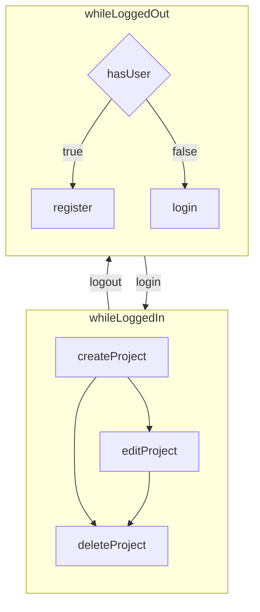
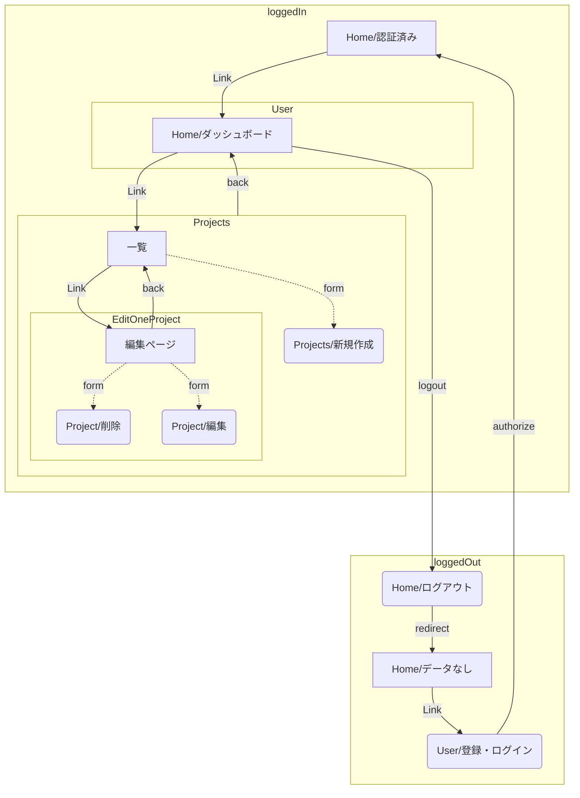

## ログイン・ログアウト

```mermaid
graph BT
  subgraph whileLoggedOut
    direction TB
    hasUser{hasUser}
    hasUser --true--> register
    hasUser --false--> login
  end

  subgraph whileLoggedIn
    direction TB
    createProject --> editProject

    createProject & editProject --> deleteProject
  end

  whileLoggedIn --logout--> whileLoggedOut
  whileLoggedOut --login--> whileLoggedIn
```

## コンポーネント

```mermaid
graph TB
  subgraph loggedIn
    Home_Active[Home/認証済み]

    subgraph User
      DashBoard[Home/ダッシュボード]
    end

    subgraph Projects
      ProjectList[一覧] --Link--> Project[編集ページ]
      Project --back--> ProjectList

      subgraph EditOneProject
        Project -.->|form| Project_Delete(Project/削除)
        Project -.->|form| Project_Edit(Project/編集)
      end

      DashBoard --Link--> ProjectList
      ProjectList -.->|form| Project_Create(Projects/新規作成)
    end


    Home_Active --Link--> DashBoard
    Projects --back--> DashBoard
  end

  subgraph loggedOut
    direction TB
    Home_Inactive[Home/データなし]
    User_Login("User/登録・ログイン")
    Logout(Home/ログアウト)
  end


  Home_Inactive --Link--> User_Login
  User_Login --authorize--> Home_Active

  DashBoard --logout------> Logout
  Logout --redirect--> Home_Inactive
```
