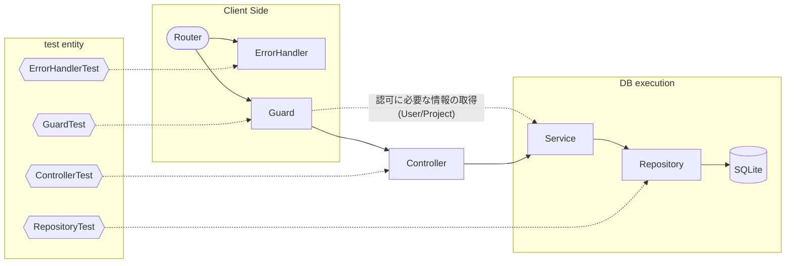
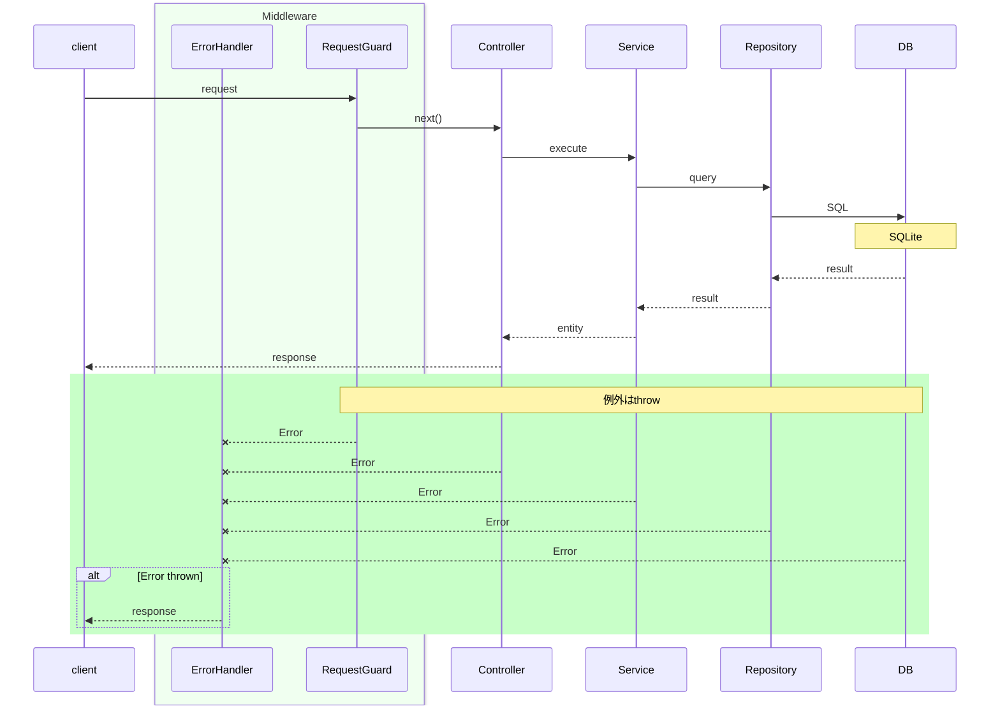

### 直近のBEテスト実行結果
```sh
current result>
 Test Files  10 passed (10)
      Tests  53 passed (53)
   Duration  4.33s (transform 1.79s, setup 0ms, import 4.81s, tests 1.30s, environment 2ms)
```

### テスト箇所と依存フロー


### BE Request Sequence

