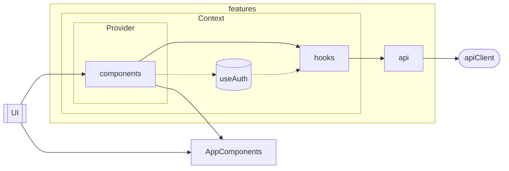

## FE Flow

```mermaid
graph LR
  direction LR

  subgraph Features[features]
    subgraph Context
      subgraph Provider
        components
      end

      components --> hooks

      components
      -.-> useAuth[(useAuth)]
      -.-> hooks
    end

    hooks --> api
  end
  apiClient([apiClient])


  UI[[UI]] --> components
  UI & components --> AppComponents
  api --> apiClient
```
