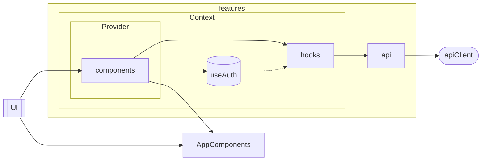

## Commands

```sh
# 依存関係のインストール
npm install

# 開発サーバー起動
npm run dev

# ビルド
npm run build

# 静的解析
npm run lint

# ビルド物のプレビュー
npm run preview
```

## FE Flow

```mermaid
graph LR
  direction LR

  subgraph Features[features]
    subgraph Context
      subgraph Provider
        components
      end

      components --> hooks

      components
      -.-> useAuth[(useAuth)]
      -.-> hooks
    end

    hooks --> api
  end
  apiClient([apiClient])


  UI[[UI]] --> components
  UI & components --> AppComponents
  api --> apiClient
```
